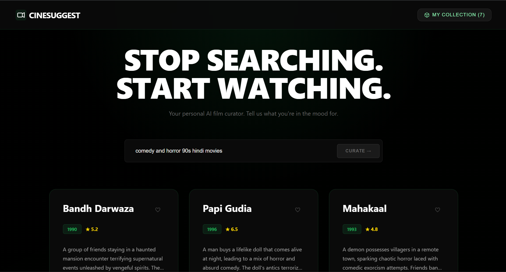

# CineSuggest - AI Movie Curator 🎬


A premium, AI-powered web application that curates movie recommendations based on your specific mood and vibe. "Stop searching, start watching."

**[🔗 Live Demo](https://movie-recommender-alpha.vercel.app/)**

---

## 📸 Screenshots


*(The Interface features a sleek cyberpunk aesthetic with glassmorphism and smooth animations)*

## ✨ Key Features

*   **🧠 AI Intelligence**: Powered by Perplexity (Sonar model) for deep, context-aware movie knowledge.
*   **🎨 Cyberpunk UI**: Immersive dark mode with neon accents and micro-interactions.
*   **📂 My Collection**: Save/Heart your favorite recommendations to a persistent local list.
*   **⚡ High Performance**: Built with Vite + Fastify for near-instant load times.

## 🛠️ Tech Stack

*   **Frontend**: React 19, Vanilla CSS (Custom Design System), Vite.
*   **Backend**: Node.js, Fastify, Better-SQLite3.
*   **AI**: Perplexity API (OpenAI SDK compatible).
*   **Deployment**: Vercel (Client) + Render (Server).

## 🚀 Run Locally

### 1. Clone & Setup
```bash
git clone https://github.com/Achyuth762/movie_recommender.git
cd movie_recommender
```

### 2. Backend Setup
```bash
cd server
npm install
```
Create a `.env` file in `server/`:
```env
PERPLEXITY_API_KEY=pplx-your-key-here
PORT=3000
```
Start the server:
```bash
npm start
```

### 3. Frontend Setup
Open a new terminal:
```bash
cd client
npm install
```
Start the client:
```bash
npm run dev
```

Visit `http://localhost:5173` to start curating.

## © License
2025 CineSuggest. Built by Achyuth.
